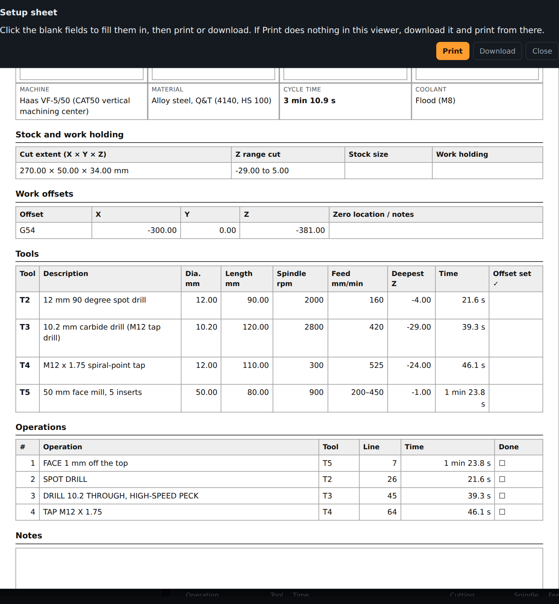
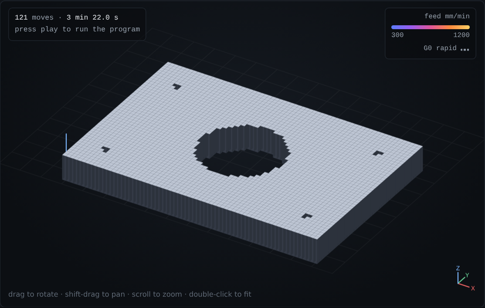
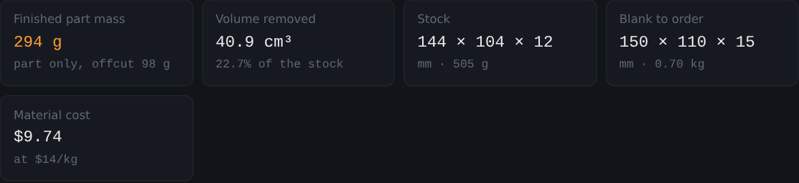

<p align="center">
  
</p>

<h1 align="center">gcode-sim</h1>
<p align="center">Check, time, cost and plan CNC milling programs in the browser. A C++20 engine, compiled to WebAssembly.</p>
<p align="center"><b><a href="https://aryaa94.github.io/G-Code/">Open it in your browser &rarr;</a></b> · nothing to install, works offline, your programs stay on your computer</p>

<p align="center">
  <a href="https://github.com/AryaA94/G-Code/actions/workflows/ci.yml"></a>
  <a href="LICENSE"></a>
  
</p>

G-code is the list of instructions a CNC mill follows. A mistake in it (a
rapid move into the part, a missing feed rate, a speed far too fast for the
material) can break a tool or scrap a part. gcode-sim reads a program before
it goes to the machine and tells you what's wrong, how long it will take,
what it will cost and what the finished part will weigh.

It's built for people who machine parts but don't have time to fight their
software: students on Formula SAE teams, makerspaces, and small shops.

## What it does

The web page has three tabs.

### Check a program

- **Finds mistakes.** Eleven lint rules, from "rapid move into the stock"
  to "spindle speed too fast for this tool in AR500 plate". Each message
  has a line number and a stable code, like a compiler. Click one to jump
  to the line.
- **Times the program** the way a motion controller would: per-axis speed
  and acceleration limits, with corner blending (look-ahead). Playback in
  3D, with the planned speed over time.
- **Time by operation.** The program is split at tool changes and at the
  comments CAM software writes ("2D CONTOUR1", "DRILL"), so you can see
  where the minutes go.
- **Setup sheet.** One click makes a printable sheet for the machinist:
  tools with sizes and speeds, work offsets, coolant, extents, an operation
  checklist, and blank fields for part number, stock and work holding.
- **Compare versions.** Save a baseline, edit, and see what changed: cycle
  time per operation, speeds and feeds, and a line diff.

<p align="center"></p>

### Make a drilling program

Paste hole positions from a spreadsheet (or build a grid or bolt circle),
pick the hole (tapped M6-M24 or a drilled size), the plate thickness and the
material, and it writes the whole program: spot drill, drill with the right
cycle for the depth (G81, G73 or G83), and tap (G84), with speeds and feeds
for the material and holes ordered to cut travel. It refuses to tap plate
too hard for a standard tap (AR500 and up) and says why.

### Plan and cost

- **Finished part and weight.** A height-map simulation cuts the program
  out of a block of stock, shows the part in 3D, and reports volume removed
  and finished mass, with offcuts and slugs separated from the part.
- **Stock and material cost.** The blank to order (with allowance), its
  weight and cost.
- **Job quote.** Shop rate, setup, load/unload and quantity give cost per
  part and per batch; tool prices and lives add tool wear.
- **Season job planner.** Add every part with its quantity: machine hours
  per machine, weeks needed at the hours you can get, a due-date check, and
  an **Export cost report (CSV)** with one row per part (material, mass,
  volume removed, machine time, costs).

<p align="center">
  
  
</p>

### Also

- **Machines**: Haas VF-2, VF-5/50 (CAT50), Mini Mill, DMG MORI DMU 50,
  Tormach 1100MX, a gantry plate mill and a GRBL hobby router, plus a
  generic benchtop mill. Each is a JSON file in
  [`examples/machines/`](examples/machines) that you can edit on the page.
- **Materials**: 6061 and 7075 aluminum, mild and alloy steel, AR400,
  AR500, 600 BHN plate, stainless 304 and Ti-6Al-4V, used for the speed and
  feed checks, the generator and the weight.
- **Real CAM output**: Fusion 360 posts for Haas (metric and inch) and GRBL,
  and plain hobby-sender files, are kept as tests
  ([`examples/real/`](examples/real)).
- **Feedback** goes straight to the developer from a form on the page, or
  as a GitHub issue. Visit counts use GoatCounter (no cookies).

## Why I built this

I did a co-op as a CAD/CAM programmer, writing and checking G-code for CNC
mills every day. I wanted to understand what happens between "export from
CAM" and "the machine starts cutting": how a controller catches a mistake,
how it decides how long a job takes, how fast it can take a corner. This
started as a simplified version of that pipeline and grew into a tool aimed
at people I know who machine parts, starting with a Formula SAE team.

## How it was built

The engine, tests, docs and web page were built with AI assistance (Claude
Code, by Anthropic), with me deciding what to build and checking it against
how shops work. [LEARN.md](LEARN.md) is my plan for owning it: walking
through every stage, breaking it on purpose, and writing the next lint rule
myself.

## How it works

```
text -> Lexer -> Parser -> Interpreter -> list of Segments -> Planner / Linter / Stats / SVG
                                                         \-> (web) operations, material removal, quote, planner
```

Only the interpreter understands G-code. It tracks the modal state (units,
plane, offsets, tool, feed, spindle, canned cycles) and turns every line
into explicit moves in millimetres. Everything after it reads that plain
list. The same C++ library runs as the command-line tool and, compiled with
Emscripten, inside the web page; the page's own features (operations,
material removal, setup sheet, quote, planner) are JavaScript on top of the
engine's output. See [docs/ARCHITECTURE.md](docs/ARCHITECTURE.md),
[docs/DESIGN_DECISIONS.md](docs/DESIGN_DECISIONS.md) and
[docs/SUPPORTED_GCODE.md](docs/SUPPORTED_GCODE.md).

```
include/gcodesim/  src/     the library: lexer, parser, interpreter, machine, materials,
                            planner, linter, stats, svg, analysis, report
cli/main.cpp                the command-line tool (CLI11)
tests/unit/                 Catch2 unit tests, one file per stage
tests/golden/               22 programs with their saved expected output
web/                        the page (head.html, ui_logic.js), its build script and browser test
examples/                   sample programs, real-CAM-style programs, machine configs
```

### Why look-ahead matters

CAM software exports curves as hundreds of tiny line segments. A machine
that stops at every corner crawls; one that blends corners keeps its speed.
On [examples/contour.nc](examples/contour.nc), a wavy groove of 200
segments:

| | Cycle time |
|---|---:|
| Stop at every segment (`--no-lookahead`) | 25.7 s |
| With look-ahead | 15.5 s |

## Command line

Needs CMake 3.25+ and a C++20 compiler (GCC, Clang, Apple Clang or MSVC; CI
builds all four). Dependencies download automatically.

```sh
cmake -S . -B build -DCMAKE_BUILD_TYPE=Release
cmake --build build
ctest --test-dir build --output-on-failure

./build/gcode-sim stats  examples/bracket.nc   -c examples/machine.json
./build/gcode-sim lint   examples/lint_demo.nc -c examples/machine.json
./build/gcode-sim render examples/bracket.nc   -c examples/machine.json --svg bracket.svg
./build/gcode-sim rules
```

```console
$ gcode-sim stats examples/bracket.nc -c examples/machine.json
Machine        Example 3-axis VMC
Cycle time     1 min 22.8 s
  cutting      1 min 04.9 s
  rapids       7.9 s
  other        10.0 s (tool changes, dwells)
Distance       787.2 mm cutting, 349.4 mm rapid
Moves          14 linear, 13 arcs, 16 rapids
Tools          T1, T2 (2 changes)
Diagnostics    0 error(s), 0 warning(s)

$ gcode-sim lint examples/lint_demo.nc -c examples/machine.json
examples/lint_demo.nc:5:1: warning[LN001]: rapid move ends at Z-4.000 (below Z0); use G1 with a feed rate
examples/lint_demo.nc:6:1: error[LN003]: cutting move with no feed rate (F) set
examples/lint_demo.nc:8:1: error[LN002]: X reaches 300.000 mm (machine coords), outside travel [-250.000, 250.000]
...
5 error(s), 5 warning(s)
```

Exit codes: `0` clean, `1` the program has errors, `2` bad usage, an
unreadable file or a bad machine config. `stats` and `lint` take
`--format json`.

To rebuild the web page: install [Emscripten](https://emscripten.org) and
run `web/build_web.sh`.

## Tests

| | |
|---|---|
| Engine | 147 ctest entries: 132 Catch2 test cases (2,824 checks) and 15 CLI exit-code tests, on Linux, macOS and Windows |
| Golden programs | 22 programs whose full output is saved, including Fusion-style posts, a plate drilled and tapped in 4140 and in AR500, and an FSAE upright |
| Sanitizers | the whole suite runs clean under ASan and UBSan in CI |
| Random input | 1,000 seeded random programs, all handled without a crash |
| Web page | 106 end-to-end checks in headless Chromium; the page's results must match the native CLI exactly |

Checked against known answers: a single plunge matches the closed-form
trapezoid, a full circle takes 2&pi;r / feed, a straight line split in two
takes as long as the unsplit line with look-ahead, and a 30 × 30 × 10 mm
square profiled out of stock comes out at exactly 9000 mm³.

## Limitations

Stated plainly, so nobody relies on it for something it doesn't do:

- **Cycle times haven't been compared with a real machine yet.** They come
  from the physics of the machine limits, which are approximate figures
  from published specs (acceleration is an estimate).
- **Speeds and feeds are handbook starting points**, not a tool maker's
  recommendations. Check them against your tooling supplier.
- **Weight is simulated on a grid** (about 1-2% error). Tools without a
  diameter in the machine config are taken as 6 mm.
- No cutter radius compensation (G41/G42), subprograms, parameters or
  rotary axes; they're reported as errors, never silently ignored.
- Rapids are timed as straight moves (many machines dog-leg), and M0/M1
  pauses and spindle spin-up add no time.
- Distances are shown in millimetres, even for inch programs.

## License

MIT, see [LICENSE](LICENSE).
