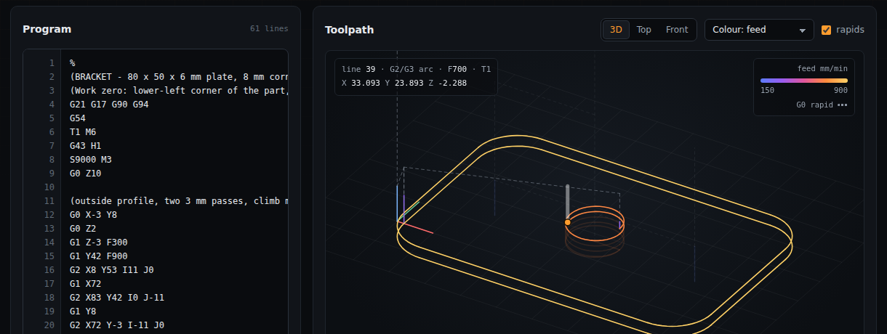
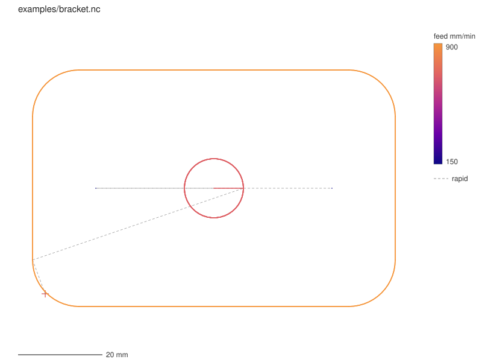

<p align="center">
  
</p>

<h1 align="center">gcode-sim</h1>
<p align="center">A G-code checker and toolpath simulator for CNC mills, written in C++20.</p>
<p align="center"><b><a href="https://aryaa94.github.io/G-Code/">Try it in your browser &rarr;</a></b> (the real C++ engine, compiled to WebAssembly)</p>

<p align="center">
  <a href="https://github.com/AryaA94/G-Code/actions/workflows/ci.yml"></a>
  <a href="LICENSE"></a>
  
</p>

gcode-sim reads G-code (the instructions a CNC mill follows), checks it for
mistakes, estimates how long it will take to run, and draws the toolpath.

- **Reads** a practical subset of milling G-code: lines, arcs in all three
  planes (I/J/K and R forms, helixes), inch and metric, absolute and
  incremental, work offsets G54-G59, G92, G53, G28, tool length offsets and
  drilling cycles G81/G82/G83 ([full list](docs/SUPPORTED_GCODE.md)).
- **Lints** with nine rules, from "rapid move into the stock" to "plunging
  deeper than the tool is wide". Every message has a line, a column and a
  stable code, like a compiler.
- **Estimates cycle time** from per-axis speed and acceleration limits, with
  corner blending (look-ahead), the way a real motion controller plans moves.
- **Draws** the toolpath as an SVG from the command line, or in 3D with
  playback in the [web version](https://aryaa94.github.io/G-Code/).
- Bad input gives error messages, never a crash (checked with 1,000 random
  programs and the sanitizers).

## Why I built this

I did a co-op as a CAD/CAM programmer, writing and checking G-code for CNC
mills every day. I got curious about what happens to that G-code between
"export from CAM" and "the machine starts cutting": how a controller catches
a mistake before it breaks a tool, how it decides how long a job will take,
how fast it can take a corner. This project is a simplified version of that
pipeline, built to understand it and to get comfortable with C++ before some
hardware projects (PID motor control, an FFT vibration analyzer).

## How it was built

The first version (interpreter, planner, linter, tests, docs and the web
page) was built with AI assistance (Claude Code, by Anthropic).
[LEARN.md](LEARN.md) is the plan for making it mine: walking through every
stage, breaking it on purpose, and writing the next lint rule myself.

## Try it

Needs CMake 3.25+ and a C++20 compiler (developed with GCC 13; CI also builds
with Clang, Apple Clang and MSVC). Dependencies download automatically.

```sh
cmake -S . -B build -DCMAKE_BUILD_TYPE=Release
cmake --build build
ctest --test-dir build --output-on-failure

./build/gcode-sim stats  examples/bracket.nc   -c examples/machine.json
./build/gcode-sim lint   examples/lint_demo.nc -c examples/machine.json
./build/gcode-sim render examples/bracket.nc   -c examples/machine.json --svg bracket.svg
./build/gcode-sim rules
```

Exit codes: `0` clean, `1` the program has errors, `2` bad usage, an
unreadable file or a bad machine config.

```console
$ gcode-sim stats examples/bracket.nc -c examples/machine.json
Machine        Example 3-axis VMC
Cycle time     1 min 22.8 s
  cutting      1 min 04.9 s
  rapids       7.9 s
  other        10.0 s (tool changes, dwells)
Distance       787.2 mm cutting, 349.4 mm rapid
Moves          14 linear, 13 arcs, 16 rapids
Cut extent     X -3.000 .. 83.000  Y -3.000 .. 53.000  Z -8.000 .. 2.000
               (86.0 x 56.0 x 10.0 mm)
Feed           150 .. 900 mm/min
Tools          T1, T2 (2 changes)
Diagnostics    0 error(s), 0 warning(s)

$ gcode-sim lint examples/lint_demo.nc -c examples/machine.json
examples/lint_demo.nc:5:1: warning[LN001]: rapid move ends at Z-4.000 (below Z0); use G1 with a feed rate
examples/lint_demo.nc:6:1: error[LN003]: cutting move with no feed rate (F) set
examples/lint_demo.nc:6:1: error[LN004]: cutting move while the spindle is not running (missing M3/M4?)
examples/lint_demo.nc:6:1: warning[LN008]: cutting move before any tool was loaded (T.. M6)
examples/lint_demo.nc:8:1: error[LN002]: X reaches 300.000 mm (machine coords), outside travel [-250.000, 250.000]
...
5 error(s), 5 warning(s)
```

`stats` and `lint` also take `--format json`. `render` takes `--color depth`,
`--no-rapids`, `--width` and `--height`.

<p align="center">
  
</p>

## Why look-ahead matters

CAM software exports curves as hundreds of tiny line segments. A machine that
stops at every corner crawls; one that blends corners keeps its speed. On
[examples/contour.nc](examples/contour.nc), a wavy groove made of 200 segments:

| | Cycle time |
|---|---:|
| Stop at every segment (`--no-lookahead`) | 25.7 s |
| With look-ahead | 15.5 s |

(Both include a 5 s tool change.) The web page shows the planned speed over
time, so you can watch the speed drop at each corner.

## How it works

```
text -> Lexer -> Parser -> Interpreter -> list of Segments -> Planner / Linter / Stats / SVG
```

Only the interpreter understands G-code. It tracks all the modal state
(units, plane, offsets, tool, feed, spindle) and turns every line into
explicit moves in millimetres. Everything after it reads that plain list.
See [docs/ARCHITECTURE.md](docs/ARCHITECTURE.md) and
[docs/DESIGN_DECISIONS.md](docs/DESIGN_DECISIONS.md), or [LEARN.md](LEARN.md)
for a guided tour.

```
include/gcodesim/  src/     the library: lexer, parser, interpreter, segment, machine,
                            planner, linter, stats, svg, analysis, report
cli/main.cpp                the command-line tool (CLI11)
tests/unit/                 Catch2 unit tests, one file per stage
tests/golden/               15 programs with their saved expected output
web/                        the browser version (Emscripten) and its end-to-end test
examples/                   sample programs and a machine config
```

## Tests

| | |
|---|---|
| Automated tests | 136 ctest entries: 121 unit/golden test cases (2,770 checks) and 15 CLI exit-code tests |
| Line coverage of the library | 96.5% |
| Sanitizers (ASan + UBSan) | the whole suite runs clean |
| Random input | 1,000 seeded random programs, all handled without a crash |
| Web page | 41 end-to-end checks in headless Chromium; the WASM results must match the native CLI |

Timing is checked against physics: a single plunge matches the closed-form
trapezoid, a full circle takes 2&pi;r / feed, a straight line split in two
takes exactly as long as the unsplit line with look-ahead. The 15 golden
programs catch any change in output. **The times have not been compared with
a real machine or a CAM system's estimate**, so treat them as estimates.

Parsing speed: on 1,000,000 lines the full interpreter (validation, modal
state, diagnostics, the move list) runs at about 2.4M lines/s, the same speed
as the bare-bones tokenizer in [bench/bench_parse.cpp](bench/bench_parse.cpp)
that does none of that. Run `build/bench_parse` for your machine's numbers.

## Limitations

- No cutter radius compensation (G41/G42), subprograms, parameters or rotary
  axes. They are reported as errors, not silently ignored.
- Rapids are timed as straight coordinated moves; many real machines move
  each axis independently ("dog-leg" rapids).
- Tight arcs at high feed are timed too optimistically (no centripetal limit
  beyond the junctions).
- M0/M1 pauses and spindle spin-up add no time.

## License

MIT, see [LICENSE](LICENSE).
